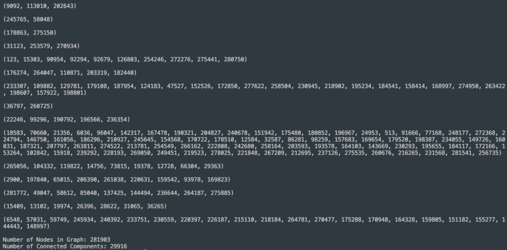

# Project Results

By the end of this project, we were able to successfully implement our algorithms to work with graph data. There were certainly aspects of the project that were more challenging than expected, but through problem-solving and working together we were able to ensure that none of our algorithms were unable to run. This document will go through each deliverable and explain it more in-depth.

## Graph Class and Project Setup

* Used adjacency list to represent graph
* Ingested graph data from text file where each line was a node
* CMakeLists to build project and download Catch2
* Additionally, we added a function to return the transverse of the graph which is utilized in the connected components algorithm

The following image shows an example of graph data from a text file to be processed:

The next image now shows the graph class outputting the nodes that were processed from the previous text file.

## BFS and Shortest Path

* BFS(int source) runs BFS from a given starting node
* getShortestPath(int dest) returns list of nodes from source to dest
* bfsAll() runs BFS() for all unvisited nodes starting from node 0
    * Returns vector of nodes traversed in order
* O(V+E)

The following image shows and example of the shortest path algorithm running on our graph data.

The following image shows and example of the BFS traversal running on our graph data.

## Strongly Connected Components

* Utilized Kosaraju’s Algorithm
* O(V+E) Time complexity
* Two DFS traversals
* Returns 2D Vector containing all connected components

The following image shows the connected components algorithm running on our graph data.

## Page-Rank

* makeMatrix() creates a column-based adjacency matrix based on adjacency list
* makeMarkov() modifies matrix so that each column sums to 1 
    * Each entry represents the probability that the node for that column will travel to that entry
* matrixVectorMultiply(vector x) pre-multiplies given vector by the Markov matrix
* pagerank() runs power iteration with Markov matrix and arbitrary starting vector
    * Computes x = Mx for many iterations until x converges to steady-state vector

## Testing Suite

You can review the tests that we wrote for our algorithms and code by reviewing the "/test" directory. Our code has passed all of our test cases. We have ensured that tests pass on our local computers as well as on EWS.

